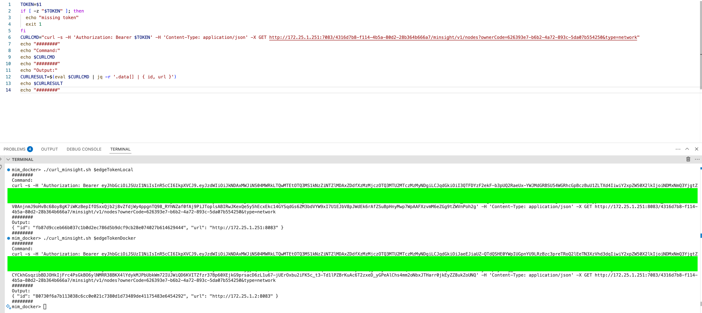

# Create Container

Run the following commands to clean-up containers and images. Or, to build a docker image, and create a docker container using mimOE.

## Reset Docker

If image was already build, and container was already created, ensure clean-up using the following script on the local machine.
- ./reset.sh

## Build Image/Create Container

Following simple scripts can build a docker image, and create a container named `mimoe-new` on the local machine.
- ./image.sh
- ./container.sh (or ./container.sh *portmap* *networkname*)

> **Note** *networkname* (e.g. bridge_172) is the custom network name, it can be blank

## Custom Bridge Network (wip)

To connect docker containers with edge containers running locally, we may need to create custom bridge network, with *same IPAM config as local machine*. For e.g., if local machine has gateway `172.25.1.1`, then we can create a custom network using the following command.

> docker network create --driver bridge --subnet 172.25.1.0/24 --gateway 172.25.1.1 bridge_172

The result can be inspected using `docker network inspect bridge_172 | jq ".[0].IPAM"`, it should have the same gateway config.

```json
{
  "Driver": "default",
  "Options": {},
  "Config": [
    {
      "Subnet": "172.25.1.0/24",
      "Gateway": "172.25.1.1"
    }
  ]
}
```

## Start Bash

To start `bash` on the container with name `mimoe-new` or anything else, please ensure `nvm use` is also added to properly link the installed packages in the `lib` folder.
> docker exec -it mimoe-new bash -c "source ~/.nvm/nvm.sh && nvm use 18.19.1 && exec bash"

# Container Runtime

Following sections are relevant once a container is started, and is in interactive mode using `bash`.

## Running Processes

If `nvm` itself, or any `npm package` seems uninstalled, please check the running processes using `ps aux`. If it shows pending installation(s), it is due to `setup.sh` which installs `nvm`, specific `global packages`, and packages for a `node project`.
| Step | Command                      | Description                        |
|------|------------------------------|------------------------------------|
| 1    | `nvm install <version>`      | Install a specific node version    |
| 2    | *(wait)*                     | Wait for the version to install    |
| 3    | `npm install <pkg>`          | Install a specific package         |
| 4    | *(wait)*                     | Wait for the package to install    |
| 5    | `npm install`                | Install from `package.json`        |
| 6    | *(wait)*                     | Wait for all packages to install   |

## Global Modules

As this setup is using `nvm` to manage multiple `nodejs` versions, the folder where global node modules are installed is given by the following path.
> /root/.nvm/versions/node/v18.19.1/lib/node_modules/

## Build Microservice

To build the starter-microservice, first `cd` into the respective folder, and run the following command.
> npm run build && npm run package && cp ./build/microservice-v1-1.0.3.tar /app/deploy

## Test/Linting Commands

From `cli-utils` following commands can be executed.
- npx eslint . --fix
- npx mocha test

# Minsight Responses (wip)

Following are minsight responses for local machine and docker container. This is being done to check if devices can see each other. Using `jq -r '.data[] | { id, url }'`, following are the expected responses. Presently, only single set is displayed, indicating that the devices cannot see each other.

```json
{
  "id": "fb87d9cceb66b037c1b0d2ec786d5b9dcf9cb28e074027b614629444",
  "url": "http://172.25.1.251:8083"
}
{
  "id": "80730f6a7b113038c6cc0e021c7380d1d73489de41175483e6454292",
  "url": "http://172.25.1.2:8083"
}
```

## Port-Mapping

As docker container is created with port-mapping (see `container.sh`) using the following command, the app instance can still be accessed from the local machine. So, even though minsight does not display all the running instances, they are still available on the same network, *using the custom docker bridge network*, which uses the same gateway address as the local machine.

> docker run --network $NETWORKNAME -idt $PORTMAP --name mimoe-new mimoe-new



> **Note** 172.25.1.251 is the local machine address

The above image shows two app instances:
1. local app instance is accessed using port 8083
2. first docker app instance is accessed using port 7083 (via port-mapping)

> **Note** 172.25.1.251 is the local machine address

## Curl Minsight

Following section describes using curl script to run minsight.

#### Local App Instance

For running on the local machine, to access local app instance, use the following command.

> ./curl_minsight.sh $edgeTokenLocal

Above command will internally call `curl` with the following options.

```bash
curl -s -H 'Authorization: Bearer $edgeTokenLocal' -H 'Content-Type: application/json' -X GET http://172.25.1.251:8083/4316d7b8-f114-4b5a-80d2-28b364b666a7/minsight/v1/nodes?ownerCode=626393e7-b6b2-4a72-893c-5da07b554250&type=network
```

- Sends an HTTP `GET` request to an API endpoint
- Uses a bearer token for authorization (`Authorization: Bearer $edgeTokenLocal`)
- Sets the content type to `application/json` via headers
- Targets a specific IP address and port (`172.25.1.251:8083`)
- Accesses the resource at `/minsight/v1/nodes`
- Filters the request using two query parameters: `ownerCode` and `type`
- Runs in silent mode using the `-s` flag (no progress or error output)

#### Docker App Instance

For running on the local machine, to access docker app instance, use the following command, settings.

> ./curl_minsight.sh $edgeTokenDocker

Above command will internally call `curl` with the following options.

```bash
curl -s -H 'Authorization: Bearer $edgeTokenDocker' -H 'Content-Type: application/json' -X GET http://172.25.1.251:7083/4316d7b8-f114-4b5a-80d2-28b364b666a7/minsight/v1/nodes?ownerCode=626393e7-b6b2-4a72-893c-5da07b554250&type=network"
```

- Sends an HTTP `GET` request to an API endpoint
- Uses a bearer token for authorization (`Authorization: Bearer $edgeTokenDocker`)
- Sets the content type to `application/json` via headers
- Targets a specific IP address and port (`172.25.1.251:7083`)
- Accesses the resource at `/minsight/v1/nodes`
- Filters the request using two query parameters: `ownerCode` and `type`
- Runs in silent mode using the `-s` flag (no progress or error output)

> **Note** edgeTokenLocal and edgeTokenDocker are respective edge tokens for mimOE app instances on local machine and docker container